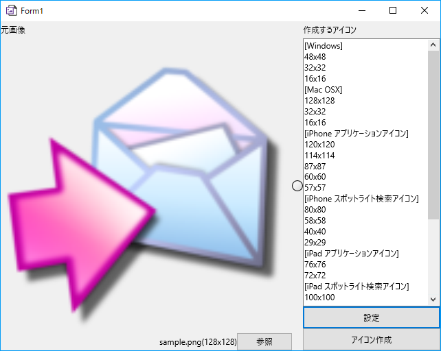
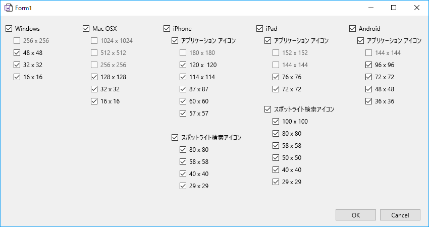

# IconMaker

## 概要

アプリケーションのアイコン画像を作成するアプリケーションです。

大きな画像をひとつ用意すれば、各プラットフォームごとに縮小画像を作成します。

昔作ったプロジェクトが見つかり、今後Delphiを使うこともないので、公開しました。  
メンテナンスやサポートを行う予定はありません。

## 開発環境

* Delphi 10.2.3で実行できることを確認しました。

## 画面

## Licence

[MIT](https://github.com/tcnksm/tool/blob/master/LICENCE)

## Author

[山本隆](https://github.com/gesource)